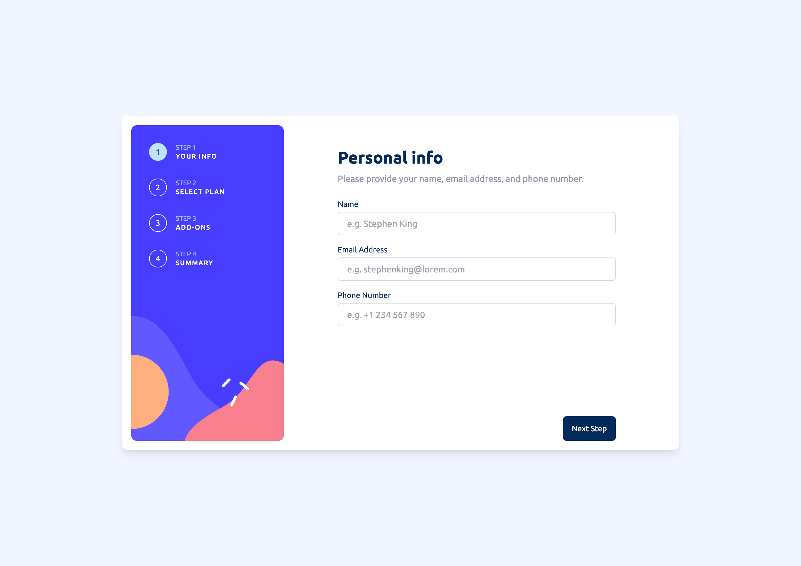

# Frontend Mentor - Multi-step form solution

This is a solution to the [Multi-step form challenge on Frontend Mentor](https://www.frontendmentor.io/challenges/multistep-form-YVAnSdqQBJ). Frontend Mentor challenges help you improve your coding skills by building realistic projects.

## Table of contents

- [Overview](#overview)
  - [The challenge](#the-challenge)
  - [Screenshot](#screenshot)
  - [Links](#links)
- [My process](#my-process)
  - [Built with](#built-with)
  - [What I learned](#what-i-learned)
  - [Continued development](#continued-development)
- [Author](#author)

## Overview

### The challenge

Users should be able to:

- Complete each step of the sequence
- Go back to a previous step to update their selections
- See a summary of their selections on the final step and confirm their order
- View the optimal layout for the interface depending on their device's screen size
- See hover and focus states for all interactive elements on the page
- Receive form validation messages if:
  - A field has been missed
  - The email address is not formatted correctly
  - A step is submitted, but no selection has been made

### Screenshot

### Links

- Solution URL: [Add solution URL here](https://github.com/stchristian/multi-step-form-main)
- Live Site URL: [Add live site URL here](https://multi-step-form-main-blush.vercel.app/)

## My process

### Built with

- Semantic HTML5 markup
- TailwindCSS
- Flexbox
- CSS Grid
- Mobile-first workflow
- [React](https://reactjs.org/) - JS library
- [Next.js](https://nextjs.org/) - React framework

### What I learned

- Margins collapse. It's been a long time since I came across with an issue caused by margin collapse but I guess we have to be always reminded. One point I was investigating why my `body` element is starting not exactly from the top of the viewport. It was caused by the top margin of a child element.

- Found a good [site](https://www.w3.org/WAI/ARIA/apg/) for accessibility with lots of examples. The selection of plans and addons are based on examples from their page.

- How to use local fonts in NextJS

- Added some e2e tests with [Playwright](https://playwright.dev/). This cmd was nice for "testing" the my tests `playwright test --project='chromium' --ui`. If I don't choose a project, test would run in all browsers

- At one point I was looking for a CSS attribute that would disable the element to create a "box". I found it: `display: contents;`. This became really useful when making the site responsive, so I avoided duplicating things.

- Learned about the `dvh` CSS unit [here](https://dev.to/frehner/css-vh-dvh-lvh-svh-and-vw-units-27k4)

- Separated the logic of the stepper with the help of generics and `React Context` into the _formWithSteps.tsx_ file. Instantiated it in _multiStepForm.ts_

- If I see very weird errors from NextJS it's probably because of a server/client component problem.

### Continued development

I think there is a lot to improve on the code.

- Form components could be even more accessible.
- I am not really satisfied with the data structure and the handling of the prices.
- Semantic elements are missing here and there.
- I could came up with a better file structure
- I feel some namings are also poorly chosen.
- More tests

## Author

- Frontend Mentor - [@yourusername](https://www.frontendmentor.io/profile/stchristian)
